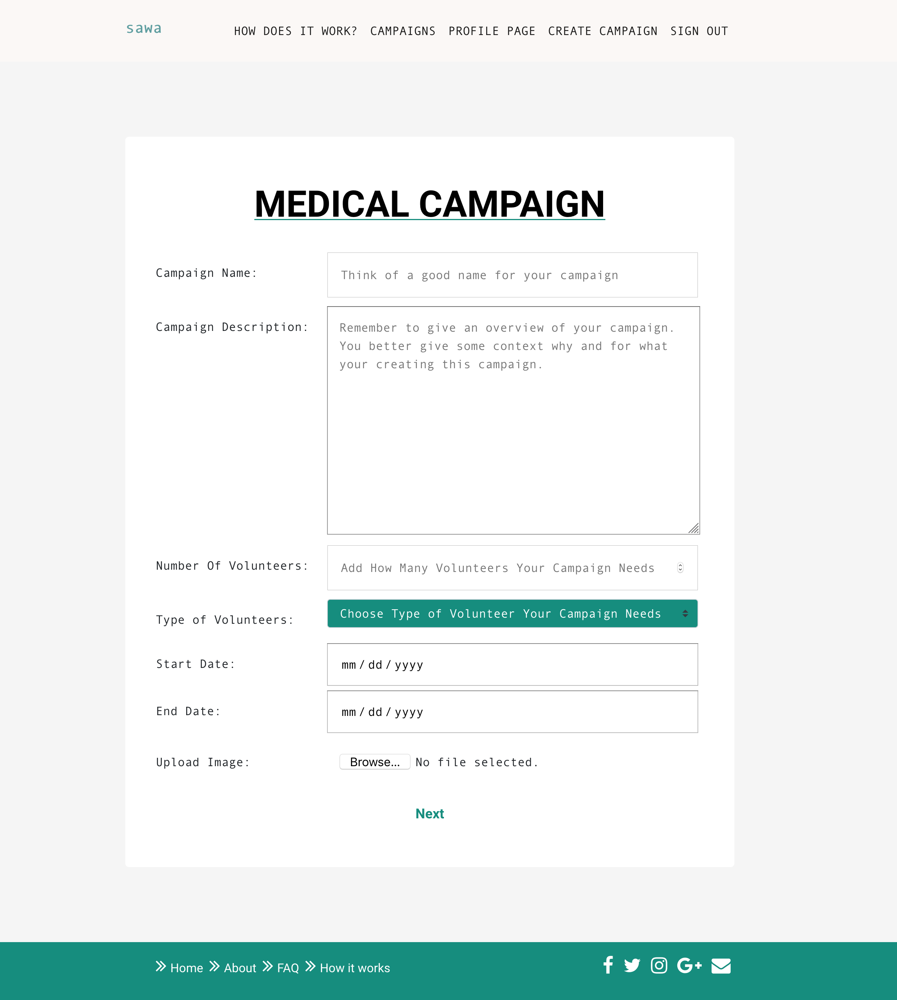

# SAWA PROJECT
This project was created with [ React App](https://github.com/facebook/create-react-app)

### Technologies:
    ReactJS, Redux for the frontend.
    NodeJS and Express for the backend.

### Clone Project:
```
    git clone "https://github.com/fahd-93/sawa.git"
```

### Installation:
```
    npm install
```

## Available Scripts

In the project directory, you can run:

```
    npm start
```

Runs the app in the development mode.<br>
Open [http://localhost:3000](http://localhost:3000) to view it in the browser.

The page will reload if you make edits.<br>
You will also see any lint errors in the console.
